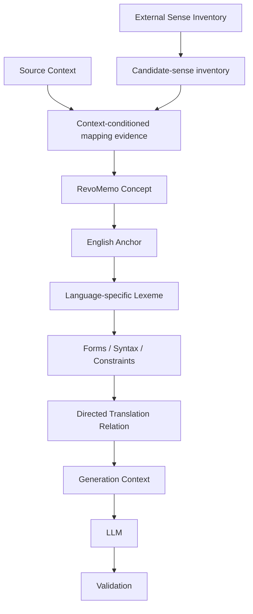

# RevoMemo Lexical Research

RevoMemo Lexical Research documents a versioned, sense-first multilingual lexical-grounding approach for evaluating whether it reduces critical educational errors in AI-generated language-learning materials.

This is a newly curated public research repository. Private production repositories, proprietary lexical datasets, learner data, and operational tooling are out of scope. The confirmatory benchmark has **not** run and has **not** been preregistered.

## Research motivation

Language-learning generation can fail even when source and target forms appear related. A useful learning item needs a specific intended meaning, a natural target realization, grammatical conditions, and an answer that can be evaluated without ambiguity.

## Research question

Does typed, sense-first lexical grounding reduce critical educational errors in generated multilingual language-learning materials compared with flat dictionary records, on-demand lexical planning, and information-matched unstructured prose?

## Lexical architecture

The architecture distinguishes external candidate enumeration from the reviewed educational decision downstream.

Open English WordNet (OEWN) is a versioned external candidate-sense inventory. An OEWN synset is neither automatically a RevoMemo concept nor ground truth. See [lexical architecture](docs/lexical-architecture.md) and [external sense inventory](docs/external-sense-inventory.md).

## Why flat mappings are insufficient

A flat source/target pair does not say which sense is intended, whether a phrase is required, which construction is natural, or which answer should be accepted. This approach treats lexical items, grammatical constraints, and directed relations as distinct evidence-bearing objects.

## Provenance and validation

Model outputs are proposals rather than linguistic truth. Each proposal is associated with the context, procedure, and evidence version it assessed; a changed context can make otherwise useful evidence stale. Deterministic checks are separated from semantic assessment, and unresolved or conflicting evidence can lead to abstention or review. See [provenance and validation](docs/provenance-and-validation.md).

## Planned experiment

The primary confirmatory design contains 240 concept-direction cases: 80 Polish-English, 80 Polish-German, and 80 Polish-Spanish. It compares four prespecified conditions, uses two independent generations per condition, and yields 1,920 planned outputs. A separate 60-case corrupted-grounding stress test and a planned secondary component-ablation analysis address distinct questions. Neither study has been executed. See the [research protocol](docs/research-protocol.md).

## Research status

A deterministic OEWN lexical-resource preflight has been completed. It describes coverage and candidate-space structure only; it is **not** confirmatory model evidence. Confirmatory generation benchmark: **NOT RUN**. Methodological refinements are documented as pre-preregistration changes in [methodology evolution](docs/methodology-evolution.md).

## Repository contents

- [Research protocol](docs/research-protocol.md)
- [Lexical architecture](docs/lexical-architecture.md)
- [External sense inventory](docs/external-sense-inventory.md)
- [Methodology evolution](docs/methodology-evolution.md)
- [Provenance and validation](docs/provenance-and-validation.md)
- [Human review gates](docs/human-review-gates.md)
- [Error taxonomy](docs/error-taxonomy.md)
- [Limitations](docs/limitations.md)
- [Reproducibility](docs/reproducibility.md)
- [Provenance note](docs/provenance-note.md)
- [Synthetic examples](examples/)

## Public/private boundary

This repository contains newly written public research documentation, aggregate preflight statistics, and invented examples only. It excludes production code, operational tooling, credentials, deployment material, private endpoints, internal administration, raw lexical records, proprietary datasets, and learner data.

## Relationship to RevoMemo

RevoMemo is the originating research and engineering context for these methodological ideas. This repository is a public research edition, not a product source release or a representation of private implementation systems.
